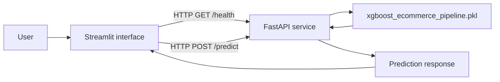

<div align="center">

# E-Commerce Purchase Prediction API

### Version 2 — A decoupled FastAPI and Streamlit application

Predict whether an e-commerce session is likely to result in a purchase by sending
behavioral and contextual features to a FastAPI backend powered by a serialized
XGBoost pipeline.

<p>
  <a href="https://fastapi.tiangolo.com/"></a>
  <a href="https://streamlit.io/"></a>
  <a href="https://www.docker.com/"></a>
  <a href="https://github.com/lintello-10/ecommerce_ml_api/actions/workflows/ci.yml"></a>
</p>

</div>

---

## Overview

This project is the **second version of an e-commerce conversion prediction
application**. It keeps the prediction objective of the first version while
separating the user interface from the inference service:

- **Version 1:** the application interface and model inference were handled in
  the same Streamlit application.
- **Version 2 (this repository):** the model is exposed through a FastAPI
  service, while Streamlit acts as a client that sends HTTP requests to the API.

The repository contains the API, the Streamlit interface, the trained model
artifact, automated tests, and the Docker configuration needed to run the
backend locally.

## Live resources

The deployed services are available here:

- **FastAPI Swagger UI:** <https://ecommerce-ml-api-gqub.onrender.com/docs>
- **Streamlit application:** <https://ecommercemlapi-nb2638m2scw3u8ztmtts4q.streamlit.app/>

The API is hosted on a free cloud instance and may need approximately
50 seconds to wake up after a period of inactivity.

> **Scope note:** This repository does not contain an MLflow tracking or model
> registry implementation. The model used at inference time is the committed
> `xgboost_ecommerce_pipeline.pkl` artifact.

## Architecture



The FastAPI service validates the request with Pydantic, encodes the country
feature, prepares a pandas `DataFrame`, and calls the serialized pipeline for
the prediction and probability. The Streamlit application displays the result
and reports the API connection status.

## Features

- FastAPI endpoints for status, health, and purchase-intent prediction.
- Pydantic validation for non-negative interaction counts.
- Explicit validation and encoding for the countries supported by the model.
- XGBoost/scikit-learn pipeline loaded with Joblib.
- Streamlit form for entering session features and calling the API.
- Dockerfile and Docker Compose configuration for local API execution.
- Pytest tests covering the root endpoint, health check, valid prediction, and
  invalid country handling.
- GitHub Actions workflow that installs dependencies and runs `pytest` on pushes
  and pull requests targeting `main` or `master`.

## Technology Stack

| Area | Technologies used |
| --- | --- |
| API | Python, FastAPI, Uvicorn, Pydantic |
| Machine learning | XGBoost, scikit-learn, pandas, Joblib |
| User interface | Streamlit, Requests |
| Testing | Pytest, FastAPI TestClient |
| Packaging and local deployment | Docker, Docker Compose |
| Continuous integration | GitHub Actions |

## Project Structure

```text
.
├── main.py                              # FastAPI application and inference endpoints
├── app.py                               # Streamlit client interface
├── xgboost_ecommerce_pipeline.pkl       # Serialized trained prediction pipeline
├── requirements.txt                      # Python dependencies for the API and tests
├── test_main.py                          # API tests
├── Dockerfile                            # Backend container image definition
├── docker-compose.yml                    # Local Docker Compose configuration
├── .github/
│   └── workflows/
│       └── ci.yml                        # GitHub Actions test workflow
├── .gitignore
└── README.md
```

## Running the API locally

### Prerequisites

- Python 3.9 or newer
- `pip`
- Docker and Docker Compose (optional, for containerized execution)

### Option 1: Run with Python

Create and activate a virtual environment, then install the dependencies:

```bash
python -m venv .venv
```

On macOS/Linux:

```bash
source .venv/bin/activate
```

On Windows PowerShell:

```powershell
.venv\Scripts\Activate.ps1
```

Install the project dependencies:

```bash
python -m pip install --upgrade pip
pip install -r requirements.txt
```

Start the development server:

```bash
uvicorn main:app --reload --host 0.0.0.0 --port 8000
```

The API is then available at:

- Root endpoint: <http://localhost:8000/>
- Health check: <http://localhost:8000/health>
- Interactive Swagger documentation: <http://localhost:8000/docs>

### Option 2: Run the API with Docker Compose

```bash
docker compose up --build
```

The Compose configuration exposes the API on port `8000` and starts Uvicorn
with reload enabled for local development. Stop the service with:

```bash
docker compose down
```

## Running the Streamlit interface

The Streamlit application is a separate client. Start the API first, then
install Streamlit and Requests if they are not already available in your
environment:

```bash
pip install streamlit requests
streamlit run app.py
```

When the interface opens, enter the URL of the FastAPI service in the sidebar.
For a local API, use:

```text
http://localhost:8000
```

The interface calls `/health` to display the connection status and `/predict`
when the prediction form is submitted.

## API usage

### Prediction request

```bash
curl -X POST "http://localhost:8000/predict" \
  -H "Content-Type: application/json" \
  -d '{
    "count_view_item": 5,
    "count_add_to_cart": 2,
    "count_begin_checkout": 1,
    "device_category": "mobile",
    "traffic_medium": "organic",
    "country": "Bahrain"
  }'
```

Example response shape:

```json
{
  "prediction": 1,
  "buyer_probability_percent": 83.42,
  "status": "High Conversion"
}
```

The `country` value must be one of the countries defined in
`COUNTRY_MAPPING` in `main.py`. The interaction counts must be greater than or
equal to zero. Invalid countries return HTTP `400`; inference failures return
HTTP `500`.

## Testing

Run the automated test suite from the project root:

```bash
pytest
```

The same test command is executed by the GitHub Actions workflow defined in
`.github/workflows/ci.yml`.

## Deployment note

The API can be deployed as a Docker-based service on a compatible hosting
platform. The Streamlit interface can be deployed separately and configured
with the public API base URL. The current application is designed as a simple
client-server prediction system; it does not include authentication, a
database, scheduled retraining, experiment tracking, or model monitoring.

## Author

**Dramé Bourama**

L3 Mathematics and Computer Science student | Aspiring Data Scientist and
MLOps Engineer

